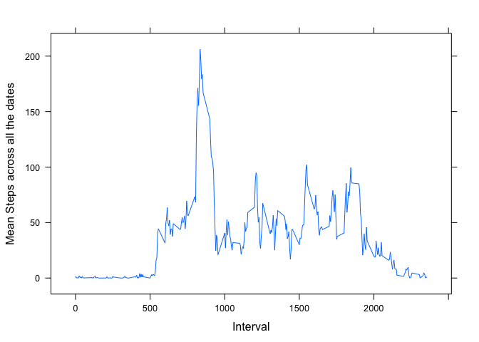
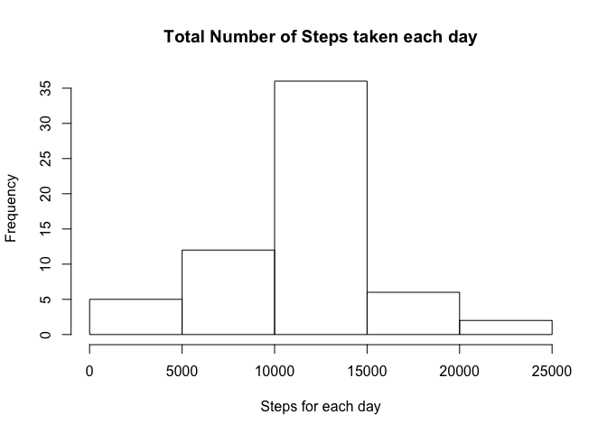
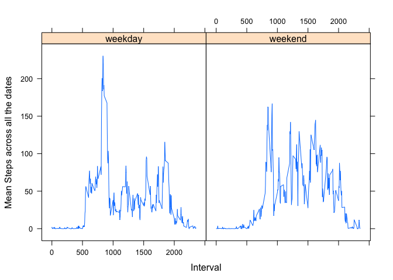

# Reproducible Research: Peer Assessment 1


## Loading and preprocessing the data
First I read the file "activity.csv" converting the date columns.
Then I summarize by date in order to have the total steps of every single day of measurement.

```r
require(dplyr) 
```

```
## Loading required package: dplyr
```

```
## 
## Attaching package: 'dplyr'
```

```
## The following objects are masked from 'package:stats':
## 
##     filter, lag
```

```
## The following objects are masked from 'package:base':
## 
##     intersect, setdiff, setequal, union
```

```r
require(lattice)
```

```
## Loading required package: lattice
```

```r
df <- read.csv2("activity.csv",sep=",")
df$date = as.Date(df$date)
df.total <- df %>% 
  filter(!is.na(steps)) %>% #remove NA
  group_by(date) %>%        #calculate sum of steps by date
  summarize(              
    s.total = sum(steps))
```

## What is mean total number of steps taken per day?
Now, in order to show the distribution of steps in every day, I plot an histogram and show relative mean and median.

```r
hist(df.total$s.total,main="Total Number of Steps taken each day",xlab="Steps for each day")
```

<!-- -->

```r
mean(df.total$s.total) # Show Mean
```

```
## [1] 10766.19
```

```r
median(df.total$s.total) # Show Median
```

```
## [1] 10765
```


## What is the average daily activity pattern?
In order to show the daily activity pattern, I calculate the mean of steps for every days in each interval. 
I still use data removing NA value from steps.


```r
df.interval <- df %>% 
  filter(!is.na(steps)) %>% #remove NA steps
  group_by(interval) %>%  #calculate mean step for every days in each interval
  summarize(s.mean = mean(steps),s.tot = sum(steps)) #calculate mean and sum
```

I show the result as a plot with interval as x-axis and the steps mean for every days as y-axis.


```r
xyplot(type="l",df.interval$s.mean ~ df.interval$interval, 
       xlab=list(label="Interval"),
       ylab=list(label="Mean Steps across all the dates")
       )
```

<!-- -->

Now I show the interval in which there is the maximum number of steps for all the days.


```r
df.interval.max <- max(df.interval$s.tot)
df.interval %>% filter(s.tot == df.interval.max) %>% select(interval)
```

```
## Source: local data frame [1 x 1]
## 
##   interval
##      (int)
## 1      835
```


## Imputing missing values

First I show how many missing values there are for steps variable.


```r
length( df$steps[is.na(df$steps)] )
```

```
## [1] 2304
```

Now, I have to choose a filling strategy. I notice that there are days in which we haven't measure, otherwise all the intervals has measurement. So I choose to use mean of interval to fill the missing steps.

**NA Filling strategy: ** I use the mean of that interval.

First, I calculate a dataframe with interval and steps mean for all the days.


```r
df.interval.mean <- df %>% filter(!is.na(steps)) %>% 
  group_by(interval) %>% 
  summarize(
    s.mean = mean(steps))
```

Then, I create a merge between the originale dataframe and the dataframe just created, in order to set the mean when the step is missing.


```r
df.fillna <- merge(df,df.interval.mean) %>% 
  mutate(steps.fillna = ifelse( is.na(steps) , s.mean, steps )) %>% 
  select(steps.fillna, date, interval) %>% 
  rename(steps = steps.fillna)
```

Now I can calculate totals and show them and the histogram of frequency.


```r
df.total.fillna <- df.fillna %>% 
  group_by(date) %>% 
  summarize(
    s.total = sum(steps))
hist(df.total.fillna$s.total,
  main="Total Number of Steps taken each day",
  xlab="Steps for each day")
```

<!-- -->

```r
mean(df.total.fillna$s.total)
```

```
## [1] 10766.19
```

```r
median(df.total.fillna$s.total)
```

```
## [1] 10766.19
```

Filling NA with the mean in interval, there aren't difference in the histogram.
The only evidence is that median and mean are the same.

## Are there differences in activity patterns between weekdays and weekends?

I have to calculate a factor variable with weekend and weekday.
In order to prevent problems with my locale, I first set the temporary locale. With this, I can match the weekdays result with the string "Saturday" and "Sunday" in order to verify if the day is a weekday or a weekend.


```r
Sys.setlocale("LC_TIME", "en_US")
```

```
## [1] "en_US"
```

```r
days.we <- c("Saturday","Sunday")
```

I create a new dataframe where I calculate a new variable "wdwe", set as "weekend" if the day is in "days.we", otherwise "weekday".
Then I summarize a mean value by interval and plot dividing by "wdwe" in order to compare the activities during weekend versus weekday.


```r
df.fillna.wdwe <- df.fillna %>% 
  mutate(wdwe = ifelse(weekdays(date) %in% days.we, "weekend","weekday")) %>% 
  group_by(interval,wdwe) %>% 
  summarize(s.mean = mean(steps)) 
xyplot(df.fillna.wdwe$s.mean ~ df.fillna.wdwe$interval | df.fillna.wdwe$wdwe, type="l",
       xlab=list(label="Interval"),
       ylab=list(label="Mean Steps across all the dates"))
```

<!-- -->

